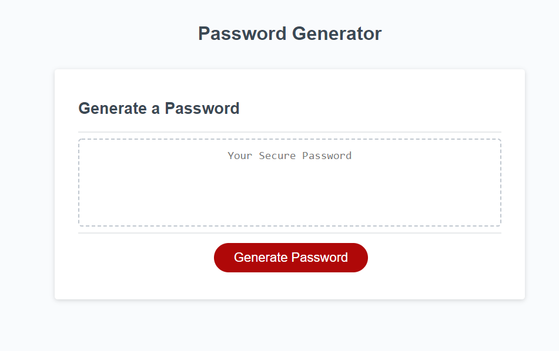

<h1>Javascript based password generator</h1>

<h2>Function</h2>
This is a password generator using the javascript language.
the application allows you to generate a custom length password between 8 - 128 characters.
You have the option to choose between lower, upper, numeric, and special characters.
It has a functioning button to generate the passwords and is completely randomized

<h2>Issues</h2>
Var charpool must be an empty array or it will populate with commas. 
Removing 'return false' on the prompt questions will allow you to exceed length limit. 
 
<h2>Future additions</h2> 
Planning on a copy to clipboard function so you can quickly save your generated password

*Developed by Thomas McCalister*